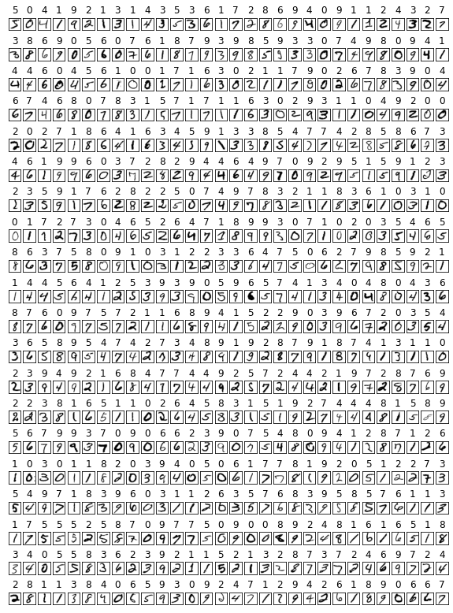

## Demo

<!-- - [ТЕХНИЧЕСКОЕ ЗАДАНИЕ](https://github.com/Pavel-Innokentevich-Galanin/4sem_coursework/blob/gh-pages/3_курсовая_ПО-4_Галанин_ТЗ.pdf) -->

- [ПОЯСНИТЕЛЬНАЯ ЗАПИСКА](https://github.com/Pavel-Innokentevich-Galanin/4sem_coursework/blob/gh-pages/3_курсовая_ПО-4_Галанин_ПЗ.pdf)
- [ПРИЛОЖЕНИЕ А - ТЕКСТ ПРОГРАММЫ](https://github.com/Pavel-Innokentevich-Galanin/4sem_coursework/blob/gh-pages/3_курсовая_ПО-4_Галанин_ПрилА.pdf)
- [ПРИЛОЖЕНИЕ Б - СХЕМА АЛГОРИТМА](https://github.com/Pavel-Innokentevich-Galanin/4sem_coursework/blob/gh-pages/3_курсовая_ПО-4_Галанин_ПрилБ.pdf)
